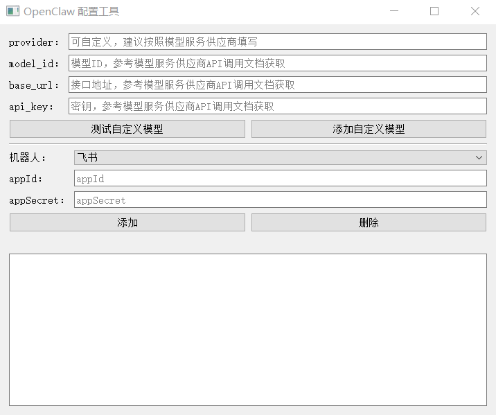

## OpenClaw 配置工具使用说明（终端用户 / exe）

这个工具用于在 Windows 上快速完成 OpenClaw 的自定义模型与渠道接入配置，并自动重启 Gateway。

### 界面截图



如未显示，请将运行界面截图保存为：`split_workspace/openclaw_tool/images/ui-main.png`。

### 使用前准备

- 电脑已安装 OpenClaw，并且在命令行可直接运行 `openclaw`
- 首次运行工具会在当前用户目录创建 `HOpenclaw-gateway.vbs`（用于重启 Gateway）

### 启动工具

双击运行 `openclaw_config_tool.exe`。

也可以在 PowerShell 中运行：

```powershell
.\openclaw_config_tool.exe
```

如果运行后提示找不到 `openclaw` 命令，请先确认 OpenClaw 已正确安装并加入环境变量。

### 界面说明

- 自定义模型：配置 OpenAI 兼容接口（provider / model_id / base_url / api_key）
- 测试自定义模型：检测 base_url + api_key 是否可用，并校验 model_id
- 添加自定义模型：写入模型配置并重启 Gateway
- 机器人：选择要配置的渠道（飞书 / QQ / 企业微信 / 钉钉 / 微信）
- appId：填入渠道提供的 appId（钉钉为 clientId；企业微信为 botId）
- appSecret：填入渠道提供的 appSecret（钉钉为 clientSecret；企业微信为 secret）
- 添加：写入渠道配置并重启 Gateway
- 删除：移除配置（或取消配置）

### 配置自定义模型（OpenAI 兼容）

在窗口上半部分填写：

- provider：可自定义，建议按模型服务供应商填写
- model_id：模型 ID（参考模型服务供应商 API 文档）
- base_url：接口地址（参考模型服务供应商 API 文档）
- api_key：密钥（参考模型服务供应商 API 文档）

按钮说明：

- 测试自定义模型：会请求 OpenAI 兼容的 `GET /v1/models` 接口，若返回列表包含 model_id 则判定成功
- 添加自定义模型：会写入 models/providers 与 Agent 默认映射配置，并在必要时自动补齐 `models.mode="merge"`，然后执行 `%USERPROFILE%\HOpenclaw-gateway.vbs` 重启 Gateway

注意：

- 日志区会对 api_key 进行掩码显示，不会明文展示

### 添加渠道配置

- 飞书：填写 appId / appSecret，点击“添加”
  - 工具会写入飞书配置并执行 `%USERPROFILE%\HOpenclaw-gateway.vbs`
- QQ：填写 appId / appSecret，点击“添加”
  - 工具会执行：`openclaw channels add --channel qqbot --token "appId:appSecret"`
  - 然后执行 `%USERPROFILE%\HOpenclaw-gateway.vbs`
- 企业微信：填写 appId / appSecret，点击“添加”
  - 工具会写入企业微信配置并执行 `%USERPROFILE%\HOpenclaw-gateway.vbs`
- 钉钉：填写 appId / appSecret，点击“添加”
  - 工具会写入钉钉配置（包含 gatewayToken 与 chatCompletions 开关）并执行 `%USERPROFILE%\HOpenclaw-gateway.vbs`
- 微信：无需 appId / appSecret，点击“添加”
  - 工具会启用 `openclaw-weixin` 插件并执行 `%USERPROFILE%\HOpenclaw-gateway.vbs`

### 删除配置

- 飞书：选择“飞书”，点击“删除”
  - 工具会执行：`openclaw channels remove --channel feishu --delete`
  - 然后执行 `%USERPROFILE%\HOpenclaw-gateway.vbs`
- QQ：选择“QQ”，点击“删除”
  - 工具会执行：`openclaw channels remove --channel qqbot --delete`
  - 然后执行 `%USERPROFILE%\HOpenclaw-gateway.vbs`
- 企业微信：选择“企业微信”，点击“删除”
  - 工具会执行：`openclaw channels remove --channel wecom --delete`
- 钉钉：选择“钉钉”，点击“删除”
  - 工具会执行：`openclaw config unset channels.dingtalk-connector`

### 插件自动安装

当你点击“添加”配置渠道时，如果检测到插件未安装，工具会自动尝试安装：

- QQ：`openclaw plugins install @tencent-connect/openclaw-qqbot@latest`
- 钉钉：`openclaw plugins install @dingtalk-real-ai/dingtalk-connector`
- 企业微信：`openclaw plugins install @wecom/wecom-openclaw-plugin`
- 微信：`openclaw plugins install @tencent-weixin/openclaw-weixin`

安装完成后工具会再次检查插件是否已出现在 `openclaw plugins list --json` 结果中；如果仍未安装成功，会在日志区打印对应安装命令，按提示手动执行即可。

说明：

- `openclaw plugins list --json` 的输出可能在 JSON 前后混入告警/日志；工具会从混杂输出中提取 plugins 列表，并仅基于 plugins 列表元素的 id 判定是否安装。

### 常见问题

- 运行后提示找不到 `openclaw`
  - 先在命令行里执行一次 `openclaw --version` 验证 OpenClaw 是否可用
  - 确保 OpenClaw 已加入环境变量（PATH）

### 日志说明

- 日志区会显示：操作类型、操作中、必要的输入信息、插件检测/安装过程、操作成功/失败信息
- 执行失败时，状态栏会提示失败与退出码
